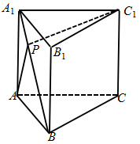
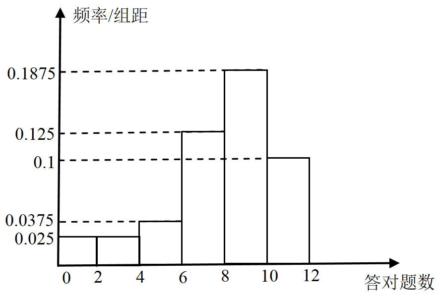
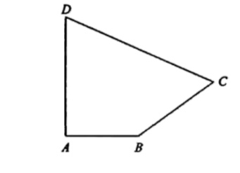
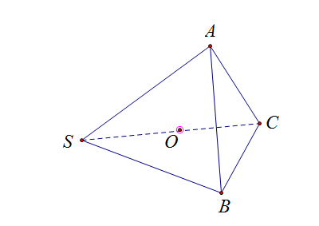
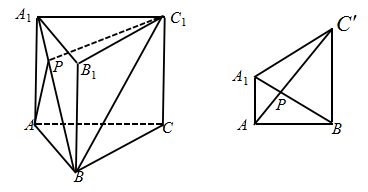
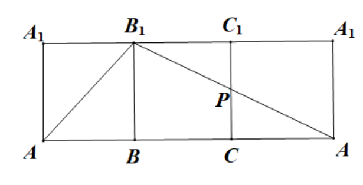
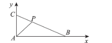
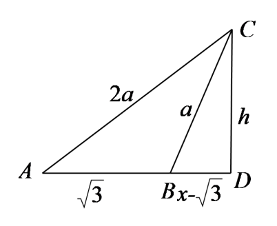

**专题22高一数学综合练习**

**一、单项选择题：**

1．下表是校篮球队某队员若干场比赛的得分数据．

|              |     |     |     |     |     |     |     |
|--------------|-----|-----|-----|-----|-----|-----|-----|
| 每场比赛得分 | 3   | 6   | 7   | 10  | 11  | 13  | 30  |
| 频数         | 2   | 1   | 2   | 3   | 1   | 1   | 1   |

则该队员得分的40百分位数是（       ）A．5B．6 C．7 D．8

2．已知是虚数单位，则复数对应的点所在的象限是（       )

A．第一象限 B．第二象限 C．第三象限 D．第四象限

3．已知菱形的对角线相交于点，点为的中点，若，，则（       ）A． B． C． D．

4．袋子中有六个大小质地相同的小球，分别标号1，2，3，4，5，6，从中随机摸出一个球，设事件*A*为摸出的小球编号为奇数，事件*B*为摸出小球的编号为2，则（       ）A． B． C． D．

5．三棱锥中，，．若为三棱锥的外接球的直径，且是该球面上的两点，，则棱锥的体积最大为（       ）A． B．2 C．3 D．6

6．设的内角，，的对边分别为，，，若，，，则的面积为（       ）A． B． C． D．

7．在《九章算术》中，将底面为矩形且有一条侧棱与底面垂直的四棱锥称为“阳马”．如图，四棱锥*P*﹣*ABCD*为阳马，侧棱*PA*⊥底面*ABCD*，*PA*＝*AB*＝*AD*，*E*为棱*PA*的中点，则直线*CE*与平面*PAD*所成角的正弦值为（       ）

A． B． C． D．

8．如图所示，在直三棱柱中，，，，*P*是上的一动点，则的最小值为（       ）A． B． C． D．3

2.  **多项选择题：**

9．一组数据，，…，的平均数是3，方差为4，关于数据，，…，，下列说法正确的是（       ）A．平均数是3 B．平均数是8 C．方差是11 D．方差是36

**填空题：**

10．甲、乙、丙三人向同一飞机射击，设击中的概率分别为0.4, 0.5, 0.8，若只有1人击中，则飞机被击落概率为0.2，若2人击中，则飞机被击落的概率为0.6，若3人击中，则飞机一定被击落，则飞机被击落的概率为\_\_\_\_\_\_\_\_\_\_.

11．在正三棱柱中，，点*P*满足，其中，则三角形周长最小值是\_\_\_\_\_\_\_\_\_\_\_.

12．在长方体中，，，，分别为，，的中点，则平面截长方体的外接球所得的截面圆的面积为\_\_\_\_\_\_\_\_\_\_\_.

13．在中，，，，点*P*是线段上一动点，则的最小值是\_\_\_\_\_\_.

**四、解答题：**

14．为了解某中学学生对《中华人民共和国交通安全法》的了解情况，调查部门在该校进行了一次问卷调查（共12道题），从该校学生中随机抽取40人，统计了每人答对的题数，将统计结果分成，，，，，六组，得到如下频率分布直方图.

（1）若答对一题得10分，未答对不得分，估计这40人的成绩的平均分（同一组中的数据用该组区间的中点值作代表）；（2）若从答对题数在内的学生中随机抽取2人，求恰有1人答对题数在内的概率.

15．在中，内角所对的边分别为，且满足．

(1)求的值；

(2)已知的面积为，求*a*的值．

16．如图，在三棱锥中，，*D*为线段的中点，*E*为线段上一点.

（1）求证：；

（2）求证：平面平面；

（3）当平面时，求直线与平面所成的角.

17．如图，在平面四边形*ABCD*中，，，，.

（1）若，求四边形*ABCD*的面积；

（2）若，，求.

18．已知向量，函数.     

（1）若且，求的值；

（2）求的最小正周期；

（3）若，，求的值.

**全解全析**

1．C由所给数据，总数为，

得分的频率分别为，

前3个得分频率和为，前2个得分的频率和为，因此40百分位数应该是第三个频率对应的得分为7分．故选：C．

2．D.

所以复数对应的点在第四象限，

故选：D

3．B解：如图，以点为坐标原点，所在直线为轴建立平面直角坐标系，

由，，

所以，，，，

所以，

所以.

故选：B

4．B事件*A*与事件*B*是互斥事件，.

故选：B.

5．B

因为三棱锥中，

所以可以补成一个以为邻边的长方体，

所以三棱锥的外接球即为长方体的外接球.

所以.

如图所示：

因为，

所以在 中，，

在 中， ，

设点*A*到平面SBC的距离为*h*，

 ，

所以当*h*最大时，体积最大，

由图可知，当平面 平面时，*h*最大.

 ，

此时：，

所以棱锥的体积最大为2.

故选：B

6．B由，可得，即，

所以，即，

又由，所以，

即，解得或（舍去），

所以，

又因为*C*为三角形内角，故，

所以的面积为.

故选：B.

7．A因为平面平面，故可得，

又平面，

故可得平面.连接.

故即为所求直线*CE*与平面*PAD*所成角.

不妨设*PA*＝*AB*＝*AD*，

故在直角三角形中，，

故可得.

则.

则直线*CE*与平面*PAD*所成角的正弦值为.

故选：.

8．B连接，得，以所在直线为轴，将所在平面旋转到平面，

                                     设点的新位置为，连接，则有.

当三点共线时，则即为的最小值.

在三角形*ABC*中，，，由余弦定理得：,所以，即

在三角形中，，，由勾股定理可得：,且.

同理可求：

因为，所以为等边三角形，所以，

所以在三角形中，,,

由余弦定理得：.

故选B.

9．BD设：，，，…，的平均数为，方差为，则，.

所以，，…，的平均数为，

方差为.

故选：BD.

10．0.492

详解：设甲、乙、丙三人击中飞机为事件 依题意，相互独立，故所求事件概率为

 即答案为0.492.

11．\##根据题意，因为，其中，

所以点在线段上.

如图所示，沿展开正三棱柱的侧面，

故三角形周长为，

当、、三点共线时，取等号.

故答案为：.

12．

如图，连结，易知平面平面，则正方形的中心到的距离等于球心到平面的距离，易知该距离等于点到距离的一半，故球心到平面的距离，长方体的外接球半径，设截面的圆的半径为，则，则该圆的面积为.

故答案为：.

13．

在中，由余弦定理得，所以是直角三角形，

以点*A*为坐标原点，所在直线为*x*轴，所在直线为*y*轴建立平面直角坐标系，

设点*P*坐标为，，，

，，

直线对应一次函数为，

所以，，

，

，对称轴，当时，

取得最小值.

故答案为：

14．（1）79；（2）（1）因为答对题数的平均数约为.

所以这40人的成绩的平均分约为.

（2）答对题数在内的学生有人，记为，；

答对题数在内的学生有人，记为，，.

从答对题数在内的学生中随机抽取2人的情况有，，，，，，，，，，共10种，

恰有1人答对题数在内的情况有，，，，，，共6种，故所求概率.

15(1)由正弦定理得：   ,

 ，   ,

 ，因为*A*，*C*是三角形内角， ，

所以 ，而由正弦定理得，∴ ，即 ；

\(2\)

由第一问可知，*b*=2*a*，设*AB*边上的高为*h*，

则三角形*ABC*的面积 ，

作下图：

过点*C*作*AB*的垂线，垂足为*D*，则*CD*=*h*，

设*AD*=*x       *，则由勾股定理得到下列方程组：

 ，解得 ，

由公式法得 ，

 ，*a*=1；

16．

（1）证明：∵，

∴平面，又平面，

∴；

（2）证明：∵，，

∴，又，，

∴平面，平面，

∴平面平面；

（3）∵平面，平面，平面平面，

∴，又平面，

∴平面，

故直线与平面所成的角为，

∵，且，∴，

∵平面，平面，

∴，又，

∴ 且，则

即直线与平面所成的角.

17．（1）（2）

解：（1）连接*BD*，在中，

由勾股定理得：，

所以，

在中，由余弦定理知：，

因为，所以，

所以，

，

所以*ABCD*的面积.

（2）在中，由正弦定理知：，

所以.

因为，

所以，.

在中，，

所以，

所以.

18．（1）由题意，向量，函数，

因为，即，可得，所以，

又因为，可得，所以.

（2）由，

所以函数最小正周期为.

（3）由（2）知，

因为，所以

又因为，所以

因为，可得，

，

所以.
