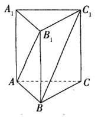
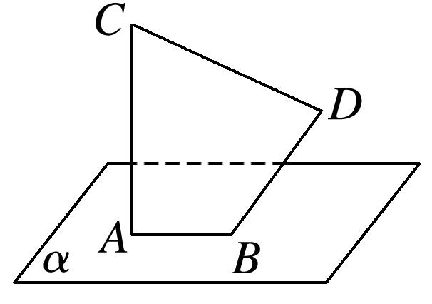
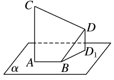

**高一数学每周一练15**

1．已知在正方体1中，2，3为空间任意两点，如果4，那么点3必（       )

A．在平面5内 B．在平面6内

C．在平面7内 D．在平面8内

2．在等边三角形ABC中，点P在线段AB上，满足9，若10，则实数*λ*的值是\_\_\_\_\_\_\_\_\_\_\_．

3．如图，在正三棱柱11中，底面12的边长为13.

（1）设侧棱长为1，试用向量法证明：15；

（2）设16与17的夹角为18，求侧棱的长.

4．如图所示，已知线段*AB*在平面*α*内，线段*AC*⊥*α*，线段*BD*⊥*AB*，且*AB*＝7，*AC*＝*BD*＝24，线段*BD*与*α*所成的角为30°，求*CD*的长．

**参考答案：**

1．C因为4

2021

22，

所以3，23，24，25四点共面.

故选：C.

2．26 设三角形ABC的边长为a,

则27

28

29

3．（1）证明：30，

因为31平面32，所以33，34，

又因为12为正三角形，

所以35，

所以36

37

38，

所以39，∴15；

（2）由（1）知40.

又41，

所以42，

所以43，即侧棱的长为2.

【点睛】

本题考查利用向量法解决立体几何问题，属于中档题.

4．44. 由45，可知46，

过点47作48，*D₁*为垂足，连接*BD₁*，

则∠*DBD₁*为*BD*与*α*所成的角，

即∠*DBD₁*＝30°，

所以∠*BDD₁*＝60°，

因为*AC*⊥*α*，*DD₁*⊥*α*，所以*AC*∥*DD₁*，

所以50，所以51.

又52，

所以53

54，

因为*BD*⊥*AB*，*AC*⊥*AB*，

所以 55，

故56

57

58，

所以

59，即60的长为44.
