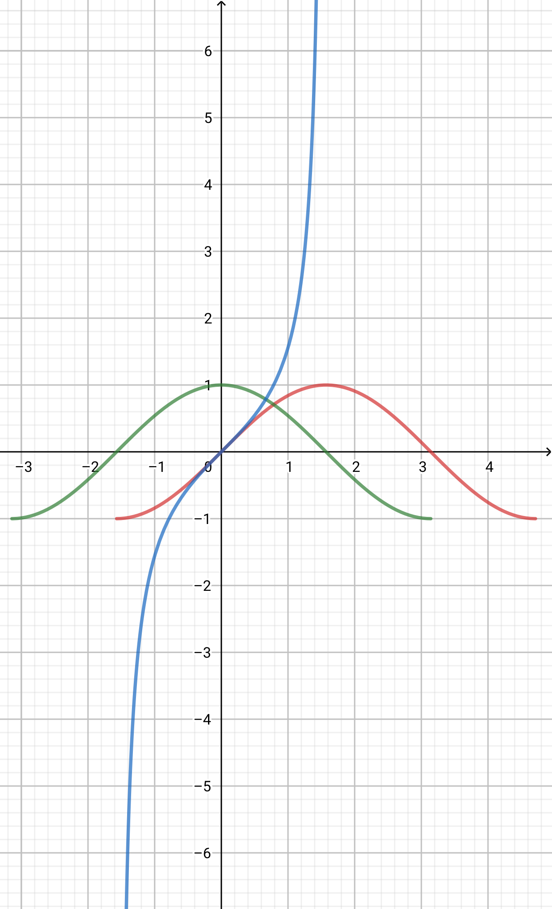

[toc]
## 知识点
### 五  三角函数  两角和与差的三角函数公式
#### 角的概念的推广
**角**: 由一条射线绕着它的端点旋转而成．
* **始边**: 旋转开始时的射线．
* **终边**: 旋转终止时的射线．
* **顶点**: 射线的端点．

角的分类：
 * **正角**: 按逆时针方向旋转所形成的角．
 * **负角**: 按顺时针方向旋转所形成的角．
 * **零角**: 未做任何旋转所形成的角．
 * **象限角**: 角的终边在第几象限，就说这个角是第几象限的角 (或说这个角属于第几象限) ．
 * **轴线角**: 角的终边在坐标轴上．

一般地，**所有与$\alpha$角终边相同的角，连同$\alpha$角在内 (而且只有这样的角) ，可以用式子
$2k\pi + \alpha, k \in \mathbb Z$
来表示．组成的集合可记作：
$ \{ \beta | \beta = 2k\pi + \alpha, k \in \mathbb Z \} $**

#### 弧度制
**角度**：
* 周角的$\frac{1}{360}$为$1^{\circ}$的角．
 
**角度制**：
* 用角度做单位来度量角的制度．
 
**弧度**：
* 等于半径长的圆弧所对的圆心角为$1 \mathrm{rad}$的角．
 
**弧度制**:
* 用弧度做单位来度量角的制度．

一般地，**正角的弧度数为正数，负角的弧度数为负数，零角的弧度数为零，任一已知角$\alpha$的弧度数的绝对值$\left| \alpha \right|=  \frac{l}{r}$，其中$l$为以$\alpha$作为圆心角时所对圆弧的长$r$为圆的半径．**

**圆弧长公式**：$$l =\left| \alpha \right| r$$
**扇形面积公式**：$$S = {l \over R} \cdot {1 \over 2\pi} \cdot \pi R^2 = {1 \over 2}\left| \alpha \right| R^2 ={1 \over 2}lR$$
    
#### 任意角的三角函数
设$\alpha$是一个任意大小的角．角$\alpha$的终边上任意一点$P$的坐标是$(x,y)$，它与原点的距离是$r(r >0)$，那么角$\alpha$的**正弦**、**余弦**、**正切**、**余切**、**正割**、**余割**分别是

| 三角函数                | 定义 | 定义域$(k \in \mathbb Z)$ | Ⅰ | Ⅱ | Ⅲ | Ⅳ |
|:-:|:-:|:-:|:-:|:-:|:-:|:-:|
| 正弦函数$\sin(\alpha)$ | $\frac{y}{r}$ | $\alpha \in \mathbb R$ | + | + | - | - |
| 余弦函数$\cos(\alpha)$ | $\frac{x}{r}$ | $\alpha \in \mathbb R$ | + | - | - | + |
| 正切函数$\tan(\alpha)$ | $\frac{y}{x}$ | $\alpha \in \mathbb R$ 且 $\alpha \neq {\pi \over 2} + k\pi$ | + | - | + | - |
| 余切函数$\cot(\alpha)$ | $\frac{x}{y}$ | $\alpha \in \mathbb R$ 且 $\alpha \neq k\pi$ | + | - | + | - |
| 正割函数$\sec(\alpha)$ | $\frac{r}{x}$ | $\alpha \in \mathbb R$ 且 $\alpha \neq {\pi \over 2} + k\pi $ | + | - | - | + |
| 余割函数$\csc(\alpha)$ | $\frac{r}{y}$ | $\alpha \in \mathbb R$ 且 $\alpha \neq k\pi$ | + | + | - | - |

#### 同角三角函数的基本关系式
1. 倒数关系：
  * $\sin(\alpha)\csc(\alpha) = 1$
  * $\cos(\alpha)\sec(\alpha) = 1$
  * $\tan(\alpha)\cot(\alpha) = 1$

2. 商数关系：
  * $\tan(\alpha) = {\sin(\alpha) \over \cos(\alpha)}$
  * $\cot(\alpha) = {\cos(\alpha) \over \sin(\alpha)}$

3. 平方关系：
  * $\sin^2(\alpha) + \cos^2(\alpha) = 1$
  * $\tan^2(\alpha) + 1 = \sec^2(\alpha)$
  * $\cot^2(\alpha) + 1 = \csc^2(\alpha)$

上述各式均为**恒等式**．
#### 诱导公式
$\sec(\alpha)$与$\csc(\alpha)$并不常用，故下表省略．

|  | $-\alpha$ | $\pi - \alpha$ | $\pi + \alpha$ | $2\pi - \alpha$ | $2k\pi + \alpha$ |
  |:-:|:-:|:-:|:-:|:-:|:-:|
| $\sin$ | - | + | - | - | + |
| $\cos$ | + | - | - | + | + |
| $\tan$ | - | - | + | - | + |
| $\cot$ | - | - | + | - | + |

概括：**$-\alpha$，$\pi - \alpha$，$\pi + \alpha$，$2\pi - \alpha$，$2k\pi + \alpha$的三角函数值等于$\alpha$的同名函数值，前面加上一个把$\alpha$看成锐角时原函数值的符号．**

#### 三角函数的图像和性质
**性质**：
  | 函数名 | 奇偶性 | 周期性 | 有界性 | 一阶导数 | 二阶导数 |
  |:-:|:-:|:-:|:-:|:-:|:-:|
  | $\sin(x)$ | 奇 | $T = 2\pi$ | 1 | $\cos(x)$ | $-\sin(x)$ |  
  | $\cos(x)$ | 偶 | $T = 2\pi$ | 1 | $-\sin(x)$ | $-\cos(x)$ |
  | $\tan(x)$ | 奇 | $T = \pi$ | 无界 | ${\sin^2(x) + \cos^2(x)}\over \cos^2(x)$ | ${2\sin(x)\cos^2(x) + \sin^3(x)}\over \cos^3(x)$ |
  | $\cot(x)$ | 奇 | $T = \pi$ | 无界 | $-{1 \over \sin^2(x)}$ | ${2\sin^2(x)\cos(x)+2\cos^3(x)}\over \sin^3(x)$ |
  | $\sec(x)$ | 奇 | $T = 2\pi$ | 无界 | $\sin(x) \over \cos^2(x)$ | ${\cos^2(x) + 2\sin^2(x)}\over \cos^3(x)$ |
  | $\csc(x)$ | 偶 | $T = 2\pi$ | 无界 | $-{\cos(x) \over \sin^2(x)}$ | $-{{2\cos(x) + \sin^2(x)}\over \sin^3(x)}$ |

**图像**（一个最小正周期内）：由上表，可得

#### 函数$y = A\sin(\omega x + \varphi), (A > 0, \omega > 0, 0 \leqslant \varphi < 2\pi), x \in \mathbb R$的图像
**作法**：
1. 作出$y = \sin(x)$
2. 向左平移$\varphi$个单位
3. 横坐标缩短到原来的$1 \over \omega$倍
4. 纵坐标伸长到原来的$A$倍

表示振动量时参数含义：
* **振幅**$A$
* **周期**$T = {2\pi \over \omega}$
* **频率**$f = {1 \over T} = {\omega \over 2\pi}$
* **相位**$\omega x + \varphi$
* **初相**$\varphi$

*********
#### 两角和与差
* $C_{\alpha \pm \beta}$：
$\cos(\alpha \pm \beta) = \cos(\alpha)\cos(\beta) \mp \sin(\alpha)\sin(\beta)$

* $S_{\alpha \pm \beta}$：
$\sin(\alpha \pm \beta) = \sin(\alpha)\cos(\beta) \pm \sin(\beta)\cos(\alpha)$

* $T_{\alpha \pm \beta}$：
$\tan(\alpha \pm \beta) = {{\tan(\alpha) \pm \tan(\beta)} \over {1 \mp \tan(\alpha)\tan(\beta)}}$

####  倍角
1. 二倍角
  * $S_{2\alpha}$：
  $\sin(2\alpha) = 2\sin(\alpha)\cos(\alpha)$
  
  * $C_{2\alpha}$：
  $\cos(2\alpha) = \cos^2(\alpha) - \sin^2(\alpha)$
  
  * $C_{2\alpha}^\prime$：
    * $\cos(2\alpha) = 2\cos^2(\alpha) - 1$
    * $\cos(2\alpha) = 1 - 2\sin^2(\alpha)$
  
  * $T_{2\alpha}$：
  $\tan(2\alpha) = {2\tan(\alpha) \over {1 - \tan^2\alpha}}$
  
2. $n$倍角
  * $S_{n\alpha}$：
  $\sin(n\alpha) = \begin{vmatrix} \sin(\alpha) & 0 & 0 & \cdots & 0 & 0 \\ 0 & 2\cos(\alpha) & 1 & \cdots & 0 & 0 \\ 0 & 1 & 2\cos(\alpha) & \cdots & 0 & 0 \\ \vdots & \vdots & \vdots & \ddots & 1 & 0 \\ 0 & 0 & 0 & 1 & 2\cos(\alpha) & 1 \\ 0 & 0 & 0 & 0 & 1 & 2\cos(\alpha) \end{vmatrix}$
  
  * $C_{n\alpha}$：
  $\cos(n\alpha) = \begin{vmatrix} \cos(\alpha) & 1 & 0 & \cdots & 0 & 0 \\ 1 & 2\cos(\alpha) & 1 & \cdots & 0 & 0 \\ 0 & 1 & 2\cos(\alpha) & \cdots & 0 & 0 \\ \vdots & \vdots & \vdots & \ddots & 1 & 0 \\ 0 & 0 & 0 & 1 & 2\cos(\alpha) & 1 \\ 0 & 0 & 0 & 0 & 1 & 2\cos(\alpha) \end{vmatrix}$
  
#### 半角
* $S_{\alpha \over 2}$：
$\sin({\alpha \over 2}) = \pm \sqrt{{1 - \cos(\alpha)} \over 2}$

* $C_{\alpha \over 2}$：
$\cos({\alpha \over 2}) = \pm \sqrt{{1 + \cos(\alpha)} \over 2}$

* $T_{\alpha \over 2}$：
$\tan({\alpha \over 2}) = \pm \sqrt{{1 - \cos(\alpha)} \over {1 + \cos(\alpha)}}$

* $T_{\alpha \over 2}^\prime$：
  * $\tan({\alpha \over 2}) = {{1 - \cos(\alpha)} \over \sin(\alpha)}$
  * $\tan({\alpha \over 2}) = {\sin(\alpha) \over {1 + \cos(\alpha)}}$

#### 积化和差
* $SC$：
$\sin(\alpha)\cos(\beta)={1 \over 2}[\sin(\alpha + \beta) + \sin(\alpha - \beta)]$

* $CS$：
$\cos(\alpha)\sin(\beta)={1 \over 2}[\sin(\alpha + \beta) - \sin(\alpha - \beta)]$

* $CC$：
$\cos(\alpha)\cos(\beta)={1 \over 2}[\cos(\alpha + \beta) + \cos(\alpha - \beta)]$

* $SS$：
$\sin(\alpha)\sin(\beta)=-{1 \over 2}[\cos(\alpha + \beta) - \cos(\alpha - \beta)]$

#### 和差化积
* $S + S$：
$\sin(\alpha) + \sin(\beta)=2\sin({{\alpha + \beta} \over 2})\cos({{\alpha - \beta} \over 2})$

* $S - S$：
$\sin(\alpha) - \sin(\beta) = 2\cos({{\alpha + \beta} \over 2})\sin ({{\alpha - \beta} \over 2})$

* $C + C$：
$\cos(\alpha) + \cos(\beta) = 2\cos({{\alpha + \beta} \over 2})\cos({{\alpha - \beta} \over 2})$

* $C - C$：
$\cos(\alpha) - \cos(\beta) = -2\sin({{\alpha + \beta} \over 2})\sin({{\alpha - \beta} \over 2})$

#### 万能
* $\sin(\alpha) = {2\tan(\alpha/2) \over {1 + \tan^2(\alpha/2)}}$

* $\cos(\alpha) = {{1 - \tan^2(\alpha/2)} \over {1 + \tan^2(\alpha/2)}}$

* $ \tan(\alpha)= {2\tan(\alpha/2) \over {1 - \tan^2(\alpha/2)}}$

#### 降幂
* $\sin^2(\alpha) = {{1 - \cos(2\alpha)} \over 2}$

* $\cos^2(\alpha) = {{1 + \cos(2\alpha)} \over 2}$

* $\sin(\alpha)\cos(\alpha) = {1 \over 2}\sin(2\alpha)$

#### 一角一函数
* $a\sin(\alpha) + b\cos(\alpha) = \sqrt{a^2 + b^2}\sin(\alpha + \varphi), \varphi = \arctan({b \over a})$

### 六 平面向量
#### 平面向量的概念
**向量（矢量）**：
* 既有大小又有方向的量

**数量（标量）**：
* 只有大小没有方向的量

**零向量**：
* 长度为$0$的向量
* 记作$\boldsymbol 0$

**单位向量**：
* 长度等于$1$个单位长度的向量

**相等向量**：
* 长度相等且方向相同的向量

**平行向量**：
* 方向相同或相反的向量
  * 规定：*零向量与任意向量平行*
  * 注意：*不能说零向量与任意向量方向相同或相反*

**线性运算**：
* **加法**：对应坐标相加
  * **加法交换性**：$\boldsymbol a + \boldsymbol b = \boldsymbol b + \boldsymbol a, \boldsymbol a, \boldsymbol b \in \mathbb R^2$
  * **加法单位元**：$\boldsymbol a + \boldsymbol 0 = \boldsymbol a, \boldsymbol a \in \mathbb R^2$
  * **加法逆元**
  * **运算律**：
    * **交换律**：$\boldsymbol a + \boldsymbol b = \boldsymbol b + \boldsymbol a, \boldsymbol a, \boldsymbol b \in \mathbb R^2$
    * **结合律**：$(\boldsymbol a + \boldsymbol b)+ \boldsymbol c= \boldsymbol a +(\boldsymbol b + \boldsymbol c), \boldsymbol a, \boldsymbol b, \boldsymbol c \in \mathbb R^2$
* **标量乘法**：$ \lambda (x, y) = (\lambda x, \lambda y), \lambda \in \mathbb R, (x ,y) \in \mathbb R^2$
  * **运算律**：
    * **交换律**：$\boldsymbol a \boldsymbol b = \boldsymbol b \boldsymbol a, \boldsymbol a, \boldsymbol b \in \mathbb R^2$
    * **第一结合律**：$(\lambda + \mu)\boldsymbol a = \lambda \boldsymbol a + \mu \boldsymbol a, \lambda, \mu \in \mathbb R, \boldsymbol a \in \mathbb R^2$
    * **第二结合律**：$\lambda（\boldsymbol a + \boldsymbol b）= \lambda \boldsymbol a + \lambda \boldsymbol b, \lambda \in \mathbb R, \boldsymbol a, \boldsymbol b \in \mathbb R^2$

**向量共线**：
* 存在唯一一个$\lambda \in \mathbb R, \boldsymbol b = \lambda \boldsymbol a$
* $\begin{vmatrix} x_a & x_b \\ y_a & y_b \end{vmatrix} = 0$

**数量积（点积）**：
* $\boldsymbol a \cdot \boldsymbol b = \left| \boldsymbol a \right| \left| \boldsymbol b \right| \cos<\boldsymbol a, \boldsymbol b >$

**平面向量基本定理**

#### 解三角形（待完成）
* **余弦定理**
* **正弦定理**
* **射影定理**
* **正切定理**
* **半角定理**

### 七 复数
#### 复数的概念
**虚数单位**：
* $\mathrm i$
* 它的平方等于$-1$，即$${\mathrm i}^2 = -1$$
* 实数与它进行四则运算时，原有的加、乘运算律仍然成立

**复数**：
* 形如$a + b{\mathrm i}(a, b \in \mathbb R)$的数
* 有序实数对$(a, b)$，其中$a, b \in \mathbb R$
* 所有复数构成的集合（复数集）记为$\mathbb C$：$$\mathbb C = \{a + b{\mathrm i} | a, b \in \mathbb R\}$$
* $\mathbb C$中的*加法*和*乘法*：$$\begin{matrix} (a + b{\mathrm i}) + (c + d{\mathrm i}) = (a + c)+(b + d){\mathrm i} \\ (a + b{\mathrm i}) (c + d{\mathrm i}) = (ac - bd) +(ad + bc){\mathrm i} \\ a, b, c, d \in \mathbb R \end{matrix}$$
* $\mathbb C$中的*减法*和*除法*：$$\begin{matrix} z_2 - z_1 = z_2 + (-z_1) \\ {z_2 \over z_1} = z_2({1 \over z_1})\\ z_1, z_2 \in \mathbb C \end{matrix}$$

**复数的算数性质**：
* **交换性**
* **结合性**
* **单位元**
* **加法逆元**
* **乘法逆元**
* **分配性质**

**分类**：
* 复数（$z$）
  * 实数（$\Im(z) = 0$）
  * 虚数（$\Im(z) \neq 0$）
    * 纯虚数（$\Re(z) = 0$）

**复数的模**：
$\left| z \right| = \sqrt{\Re^2(z) + \Im^2(z)}$

**共轭复数**：
$\bar z = \Re(z) - \Im(z)$

**形式**：
  1. 代数形式 $a + b{\mathrm i}(a, b \in \mathbb R)$
  2. 三角形式 $r[\cos(\theta) + {\mathrm i}\sin(\theta)], r \geqslant 0, 0 \leqslant \theta < 2\pi$
  3. 指数形式 $r{\mathrm e}^{{\mathrm i}\theta}, r \geqslant 0, 0 \leqslant \theta < 2\pi$

**复数相等**：
* $\Re(z_1) = \Re(z_2), \Im(z_1) = \Im(z_2) \Leftrightarrow z_1 = z_2$
* $\left| z_1 \right| = \left| z_2 \right|, \arg(z_1) = \arg(z_2) \Leftrightarrow z_1 = z_2$

## 例题
### 三角函数 两角和与差的三角函数公式
#### 三角函数的概念
##### 由定义／终边求某角三角函数
1. （2021·北京顺义·高一期末）在平面直角坐标系中，角$\alpha, \beta$的终边关于直线$x - y = 0$对称，若$\cos(\alpha)= -{1 \over 3}$，则$\sin(\beta)=$

##### 由单位圆求三角函数值
1. 