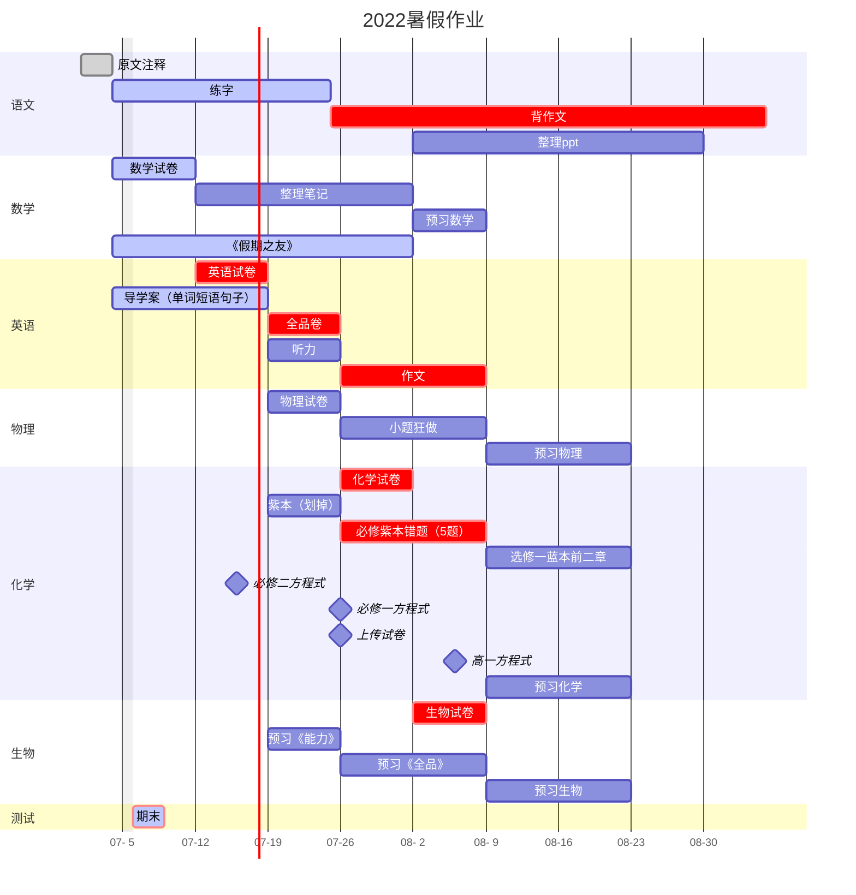

## 07-04

* [x] 练字一
* [x] 数学试卷一、二
* [x] 假期之友一
* [x] 导学案U1

## 07-05

- [x] 练字二
- [x] 数学试卷三、四
- [x] 假期之友二
- [x] 导学案U2P1~2

## 07-08（ddl）

> ~~前几天在写试卷，不计入~~

- [x] 练字三、七、八
- [ ] 数学试卷五、六、七、八
- [x] 假期之友三
- [ ] 导学案U2P3~4
- [x] 学校练习试卷一张
- [ ] 《全品》试卷一张
- [ ] 听力\*2
- [ ] 
